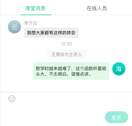

## 消息区

### 文件位置

`UI 模板`: components/chat/chat.html

`逻辑操作:` components/chat/chat.js

> data

|  属性名      | 类型     | 说明     |
| :---------- | :------- | :------- |
| messageList | Array |  消息列表 |

> methods

#### sendText

发送文字消息

#### sendImage

发送图片消息

#### sendFile

发送文件消息