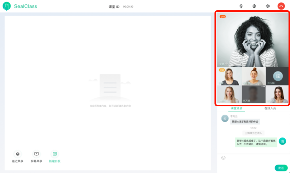

## 音视频展示区

### 文件位置

`UI 模板`: components/rtc/rtc.html

`逻辑操作:` components/rtc/rtc.js

### 子模块

`音视频用户展示:` [rtc-user](./rtc/rtc-user.md)

`操作本地音视频:` [self-rtc-operate](./rtc/self-user-operate.md)

> props

|  属性名      | 类型     | 说明     |
| :---------- | :------- | :------- |
| loginUser | Object |  登录用户 |
| userList |  Array | 房间人员列表 |
| hungup |  Function | 挂断 |

> computed

|  属性名      | 类型     | 说明     |
| :---------- | :------- | :------- |
| showUserList | Array |  展示用户列表 |
| teacher |  Object | 主讲人 |

> watch

#### loginUser.role

当角色变成列席时, 取消推流. 当列席升级为学员时, 开始推流