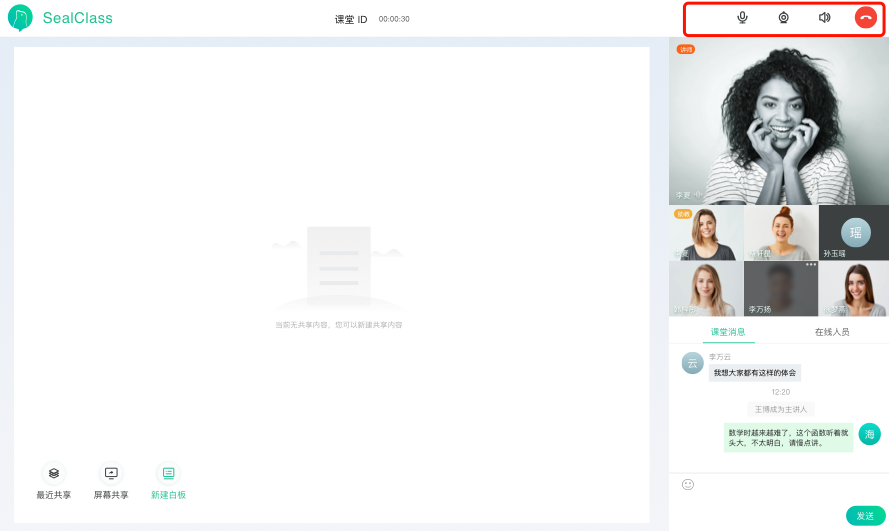

## 登录用户本地操作

### 文件位置

`UI 模板`: components/rtc/self-user-operate/self-user-operate.html

`逻辑操作:` components/rtc/self-user-operate/self-user-operate.js

> props

|  属性名      | 类型     | 说明     |
| :---------- | :------- | :------- |
| user | Object |  展示用户 |
| isBanZoom |  Boolean | 是否阻止点击展示大窗口 |
| isShowScreenShare |  Boolean | 是否展示屏幕共享流 |

> data

|  属性名      | 类型     | 说明     |
| :---------- | :------- | :------- |
| isShowBig | Boolean |  是否已展示大窗 |

> computed

|  属性名      | 类型     | 说明     |
| :---------- | :------- | :------- |
| isShowVideo | Boolean |  是否展示视频 |
| isVideoOpened |  Boolean | 是否已打开摄像头 |
| role |  String | 用户角色 |
| isSelfScreenShare |  Boolean | 是否为自己展示的屏幕共享 |

> methods

#### showRTCWindow

大窗展示用户视频