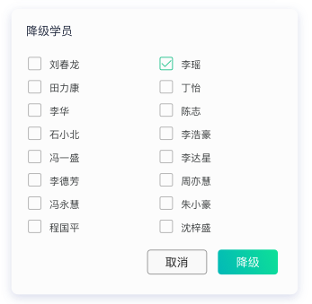

## 降级弹框

### 文件位置

`UI 模板`: dialog/dialog/degrade.html

`逻辑操作:` dialog/dialog/degrade.js

> data

|  属性名      | 类型     | 说明     |
| :---------- | :------- | :------- |
| userList | Array |  用户列表 |

> computed

|  属性名      | 类型     | 说明     |
| :---------- | :------- | :------- |
| hasSelected | Boolean |  是否已选中 |

> methods

#### selectUser

选择用户

#### confirm

确认降级