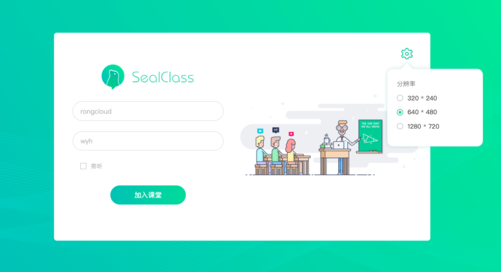

## 登录页面



### 文件位置

`UI 模板`: pages/login/login.html

`逻辑操作:` pages/login/login.js

### 基本实现

1、 姓名、会议、分辨率、列席的选择 都通过 Vue 数据绑定实现

2、 姓名、会议验证通过 focus/blur 时检查数据实现, 具体参考代码: common/mixins.js validate

3、 点击加入按钮, 调用步骤为:

```js
* 调用 SealMeeting Server join 接口
* 初始化、设置监听、连接 IM(即时通讯) SDK
* 初始化、设置监听、连接 RTC(音视频) SDK
* 进入会议页面
```

4、 当房间内学员人数已满时, SealMeeting Server 返回对应错误码, Web 弹框提示: 会议学员人数已满，是否以列席身份加入？点击同意后, 再次执行步骤 3

> data

|  属性名      | 类型     | 说明     |
| :---------- | :------- | :------- |
| isLoading | Boolean |  是否正在进入房间 |
| roomId |  String | 房间号 |
| userName |  String | 姓名 |
| isAudience |  Boolean | 是否为列席  |
| resolution |  Object | 分辨率  |

> methods

#### initRoom

初始化房间, 包含: 调用 SealMeeting Server join、连接 IM 、连接 RTC

#### toClassPage

Vue 路由至会议页面

#### setRoomStorage

进入会议后, 将 roomId、userName 存入 localStorage

#### confirmEntryWithAudience

当会议人员满员时, 弹框确认是否以列席身份进入会议, 确认后进入房间

#### entryClass

进入会议, 调用 initRoom、confirmEntryWithAudience、toClassPage

#### filterValueSpace

消除输入框首位的空格
